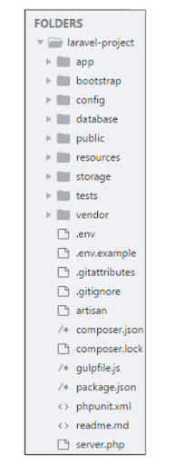

> 프레임워크에 대해 hackr에 작성된 글을 번역한 글입니다.  오역이 있을 수 있습니다.
>
> 원문: <https://hackr.io/blog/what-is-frameworks>

당신이 프로그래머로서 코드를 짤 때 당신을 도와줄 디자인된 툴이 있다면 완전히 처음부터 시작할 필요는 없다. 프레임워크는 이미 개발된 소프트웨어이고 애플리케이션을 빌드하기 위해 개발자들에 의해 사용된다.

## What is Frameworks?

프레임워크들은 여러 실험적인 소프트웨어 엔지니어와 프로그래머들에 의해서 자주 빌드되고, 테스트되고, 최적화되었기 때문에 다재다능하고, 팔팔하고, 유능하다.

애플리케이션을 빌드하기 위해 프레임워크를 사용하는 것은 당신이 애플리케이션의 높은 레벨의 기능들에 집중할 수 있도록 해준다. 왜냐하면, 프레임워크들이 낮은레벨의 기능들을 맡아주기 때문이다.

## Why do we use Frameworks?

소프트웨어를 개발하는 것은 복잡한 과정이다. 그것은 코딩, 디자인, 테스트 등을 포함한 과다한 업무들이 필요하게 된다. 코딩 파트만 따지면, 프로그래머들은 syntax, declarations, garbage collection, statements, exceptions 등을 관리해야 한다.

프레임워크는 하나의 플랫폼으로 개발자들이 소프트웨어의 전체적인 개발 과정 혹은 대부분의 것들을 다루지 않게 도와줌으로써 편해지게 만들어준다.

프레임워크를 사용하면 얻게 되는 이점들 :

- 더 좋은 프로그래밍 관례들을 설립하고, 적합한 디자인 패턴 사용에 도움이 된다.
- 코드가 더 안전하다.
- 복제 그리고 불필요한 코드 작성을 피할 수 있다.
- 버그가 적어지고, 일관된 코드 개발에 도움이 된다.
- 정교한 기술들 위에서 일하기 쉬워진다.
- 어떤 사람은 프레임워크를 만들 수 있고, 혹은 프레임워크 오픈 소스에 기여할 수 있다. 그러므로, 기능적인 면에서 연속적인 향상이 있다.
- 여러 코드 부분들과 기능들은 이미 빌드되었고 테스트되어졌다. 이것은 애플리케이션을 더욱 신뢰하게 만들어준다.
- 테스트 하는 것과 코드를 디버깅하는 것은 매우 쉽고, 직접 짠 개발자가 아니더라도 할 수 있다.
- 애플리케이션 개발에 요구되는 시간이 상당히 줄어든다.

## What goes in a Framework?

당신이 프레임워크를 설치했을 때, 가장 먼저 당신이 신경써야 하는 것은 시스템 요구 사항이다. 프레임워크가 설치되고 환경 설정 되자마자, 그것은 디렉터리 구조를 만든다.

예를 들어, 아래 그림은 Laravel 프레임워크의 디렉터리 구조이다. 이 폴더의 각각은 추가적인 디렉터리를 가질 수 있다. 디렉터리들은 더 나아가 파일, 클래스, 테스트 루틴, 템플릿 등을 가질 수 있다.

### Difference between a Library and a Framework

어떤 사람들은 프레임워크를 라이브러리의 일종이라고 생각할지도 모른다. (라이브러리가 precompiled routines의 일종인 것 처럼) 하지만, 모든 프레임워크들이 라이브러리를 사용하거나 라이브러리에 의존하지 않기 때문에 사실이 아니다.

라이브러리와 프레임워크의 차이점은 후자(프레임워크)는 코드를 호출한다는 점이다. 이와 반대되게, 라이브러리의 경우에는 코드가 라이브러리를 호출한다. 예시를 통해 이해해보자.

Curl은 PHP의 라이브러리다. Curl의 함수 중 하나를 사용하고 싶을 때, PHP 코드는 Curl 라이브러리 안에 있는 특정 함수를 호출한다.

Laravel과 같은 PHP 프레임워크를 사용하고 싶을 때는 관계가 뒤바뀐다. 그래서 프레임워크는 프레임워크에 쓰여진 애플리케이션 코드를 호출한다. 이것은 기술적인 용어로 [Inversion of Control (IoC)](https://en.wikipedia.org/wiki/Inversion_of_control) 으로 알려져있다.

### Programming language vs Frameworks

프로그래밍 언어는 컴퓨터에 그것이 해야 할 일을 전한다. 모든 프로그래밍 언어는 구문과 특정한 규칙을 가지고 있다. 코드가 쓰여질 때마다 그것은 지켜져야 한다.

프레임워크는 프로그래밍 언어 위에 구축된다. 예를 들면,

(Ruby on Rails라고 알려진) Rails는 프로그래밍 언어인 Ruby 위에서 구축된 웹 프레임워크이다.

Django와 Flask는 프로그래밍 언어인 Python 위에서 구축된 두 가지의 다른 웹 프레임워크이다. 그러므로 그들은 `Python 프레임워크`로 알려져 있다. React, 그리고 Angular는 프로그래밍 언어인 JavaScript 위에서 구축된 front-end web 프레임워크이다.

## Types of Frameworks

개발자로서, 당신은 당신의 필요에 맞는 최고의 프레임워크를 찾아야만한다. 웹 사이트, 데이터 과학, 데이터베이스 관리, 혹은 모바일 애플리케이션, 어디에서 작업하든지 프레임워크는 소프트웨어 프로그래밍의 모든 장르를 위해 존재한다.

다양한 범위의 애플리케이션 개발 영역에서 애플리케이션을 개발하기 쉽게 만들어주는 많은 종류의 프레임워크들이 있다.

### A word of Advice Before Starting with Software Frameworks

애플리케이션 개발을 위해 프레임워크를 사용하기 이전에, 프로그래밍 언어의 미묘한 차이를 배움으로써 코딩 스킬들을 배우고 발전시키는 것은 좋은 생각이다. 그렇지 않으면, 당신은 프레임워크에 존재하는 근본적인 기술들과 함께 가치있는 경험을 놓칠지도 모른다.

만약 당신이 아직 전문 개발자가 아니라면, 프레임워크를 구축하는 코드를 먼저 이해하는 것이 필수적이다. 이 지식은 당신이 복잡한 챌린지를 마주쳤을 때 쉽게 해결하도록 만들어 줄 것이고, 당신을 전반적으로 기술적인 개발자로 만들어줄 것이다.

많은 프론트엔드 개발자들은 전체 커뮤니티의 개발자들을 지원하기 위해 프레임워크 오픈 소스들에 기여한다. 예를 들면, 구글의 개발자는 AngularJS와 Polymer을 구축했다. 둘 모두 모든 프론트엔드 개발자들이 자유롭게 이용 가능하다.

많은 개발자들은 또한 라이브러리 오픈 소스에도 기여를 함으로써, 프론트엔드 커뮤니티를 지원한다.

## Conclusion

애플리케이션 개발에 프레임워크를 사용하고 싶은 프로그래머들을 위한 결과적인 제안은 개발하려고 하는 애플리케이션의 필요를 바탕으로 새로운 프레임워크 혹은 프로그래밍 언어를 배우는 것이다.

더 나아가서, 프론트엔드, 백엔드, 클라우드 관리, 그리고 모바일 기술과 같은 영역들이 시장에서 기술이 공유될 가능성, 지속가능성 등을 분석해라. 그리고 무엇을 할지 결정하기 이전에 그 기술의 특징을 이해하도록 해라.
